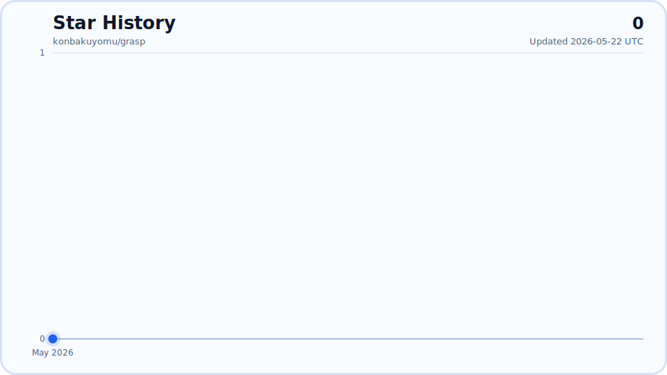

# Grasp

[English](./README.md) · [简体中文](./README.zh-CN.md) · [GitHub](https://github.com/Yuzc-001/grasp) · [Issues](https://github.com/Yuzc-001/grasp/issues)

[](./CHANGELOG.md)
[](./LICENSE)
[](./README.md#quickstart)

> **Grasp is a route-aware browser runtime for agents. It is not just for opening pages — it helps AI keep real web tasks moving forward in the browser.**

Real web tasks rarely stay on a clean, ideal path. They cross login state, workspace surfaces, real forms, and gated pages. They get interrupted by checkpoints, human handoff, or the need to pause and continue later. Many tools can open a page and even get through a few steps. The hard part is keeping the task going when the workflow becomes real — without restarting, guessing success, or losing context.

That is the layer Grasp is built for. Given a URL and an intent, Grasp chooses the best path first, works inside a dedicated local browser runtime, and checks actions against actual page state. When a workflow needs a human step or has to continue later, it can return to the same browser context with evidence and keep going from there.

It is a runtime for real web tasks — built to keep work continuous, verifiable, and recoverable in the browser.

- Current package release: `v0.6.8`
- Browser Runtime Landing: [docs/browser-runtime-landing.html](./docs/browser-runtime-landing.html)
- Docs entry: [docs/README.md](./docs/README.md)
- Release notes: [CHANGELOG.md](./CHANGELOG.md)

---

## Why Grasp exists

Opening a page is easy. Keeping real web work moving is hard.

Real web tasks do not live inside a single happy path. They run into login state, checkpoint pages, dynamic surfaces, real forms, authenticated workspaces, and moments where a human has to step in. If a system can only start over when that happens — or simply assumes an action succeeded — it is still doing one-off page interaction, not task delivery you can trust.

Grasp is built for a different layer: helping an agent continue working when a task depends on state, runs into blocked pages, or gets interrupted. That means choosing a route before acting, confirming the current state before deciding the next step, verifying that the page actually changed as expected, and preserving evidence when the workflow needs handoff or later recovery in the same browser context.

---

## What makes Grasp different

Grasp is not about having more browser features. It focuses on the parts that decide whether a real task can continue or not:

- **Continuity** — tasks survive login state, checkpoint pages, and context switching instead of restarting from scratch
- **Verification** — actions are not treated as success by default; they are checked against actual page changes
- **Contract truthfulness** — task status is explicit (`ready`, `blocked_for_handoff`, `ready_to_resume`, `resumed`, `needs_attention`, `warmup`, `mixed`), so mixed outcomes are represented as mixed instead of being flattened into success
- **Recovery** — human handoff is part of the workflow, not an edge case
- **Route choice** — users and agents do not need to reason about which low-level path a URL should follow

That is what makes Grasp more than a tool that can operate a page. It is closer to a runtime that can carry real web tasks forward.

---

## The smallest proof of the runtime

The smallest proof of Grasp is not that it can open a page. It is that the same task can continue inside the same browser context:

```text
entry(url, intent)
inspect()
request_handoff(...)
mark_handoff_done()
resume_after_handoff()
continue()
```

If a task can survive a human step, return to the same browser context, and continue from page evidence instead of restarting, that is runtime behavior.

What it does not claim:

- universal CAPTCHA bypass
- guaranteed autonomous completion on every high-friction site
- evidence-free recovery
- that any one workflow defines the whole product

---

## Quickstart

### 1. Bootstrap Grasp locally

```bash
npx -y @yuzc-001/grasp
```

Grasp detects Chrome or Edge, launches the dedicated `chrome-grasp` profile, establishes a visible local browser runtime, and helps you connect it to your AI client.

By default, this connects Grasp’s own CDP runtime. Unless you explicitly point it at another CDP endpoint, it is not claiming control over an arbitrary browser window the user happens to have open.

If you already have the CLI installed, `grasp connect` performs the same local bootstrap step.

Bootstrap also establishes the remote-debugging / CDP connection Grasp needs. In the normal local path, users do not need to prepare that separately.

### 2. Connect your AI client

Claude Code:

```bash
claude mcp add grasp -- npx -y @yuzc-001/grasp
```

Claude Desktop / Cursor:

```json
{
  "mcpServers": {
    "grasp": {
      "command": "npx",
      "args": ["-y", "@yuzc-001/grasp"]
    }
  }
}
```

Codex CLI:

```toml
[mcp_servers.grasp]
type = "stdio"
command = "npx"
args = ["-y", "@yuzc-001/grasp"]
```

### 3. Get your first real win

Tell your AI to:

1. call `get_status`
2. use `entry(url, intent)` on a real page
3. call `inspect`
4. continue with `extract`, `extract_structured`, `continue`, or the handoff / resume flow as needed
5. use `explain_route` or run `grasp explain` when you want the route rationale

The first win is not simply that a page opens. It is that the system can choose a path, understand the current state, and stay inside the same runtime as the task becomes more complex.

References:

- [docs/reference/mcp-tools.md](./docs/reference/mcp-tools.md)
- [docs/reference/smoke-paths.md](./docs/reference/smoke-paths.md)

---

## Core workflows

### Real browsing first

Whenever Grasp can enter a real page and a real session, it should prefer reading and acting from the current browser state instead of falling back to heavier observation chains or search-like shortcuts.

### Public read

When a page is publicly readable, use:

```text
entry(url, intent="extract") -> inspect -> extract
```

What you get:

- route decision
- current page state
- readable content
- suggested next action

### Structured extraction

When you want the current page converted into a field-based record, use `extract_structured(fields=[...])` while staying on the same runtime path.

What you get:

- a field-based `record`
- `missing_fields` when the page does not expose a requested value clearly enough
- evidence for matched labels and extraction strategy
- JSON export, plus optional Markdown export

When you want to apply the same extraction contract across multiple URLs, use `extract_batch(urls=[...], fields=[...])`.

What you get:

- one structured `record` per URL
- exported `CSV` and `JSON` artifacts, plus an optional Markdown bundle
- honest per-URL contract status, including mixed outcomes (`meta.status = mixed`) instead of pretending the batch fully succeeded
- a batch summary in `meta.result.batch_summary`, plus explicit recovery guidance in `meta.result.recovery_plan`
- per-record route / task / verification truth in `meta.result.records[*]`

### Share layer

When the result needs to be forwarded to someone else and the original page itself is not suitable to share directly, use `share_page(format="markdown" | "screenshot" | "pdf")`.

What you get:

- a locally written share artifact
- a clean share document generated from the current page projection rather than raw page chrome
- the same runtime traceability back to the page and route that produced it

When you want to understand how the share card will be laid out before exporting it, use `explain_share_card()`. When available, this uses Pretext-backed layout estimates to reason about title and summary density without touching the current page DOM.

### Live session

When the task depends on current login state, a real workspace, or a form flow, start with `entry(url, intent="act" | "workspace" | "submit")`.

`entry` can return evidence such as:

- selected mode
- confidence
- fallback chain
- whether human handoff is required

### Handoff and recovery

When a workflow needs a human step, do not pretend the system is fully autonomous. Keep that human step inside the task flow:

1. `entry` or `continue` sees that the page is blocked
2. `request_handoff` records the human step
3. `mark_handoff_done` marks it complete
4. `resume_after_handoff` reacquires the page with continuation evidence
5. `continue` decides whether to proceed, wait, or request another handoff

---

## Real forms

When the page is a real form, prefer the specialized form surface:

```text
form_inspect -> fill_form / set_option / set_date -> verify_form -> safe_submit
```

The default behavior is conservative:

- `fill_form` only writes `safe` fields
- `review` and `sensitive` fields are held back for explicit review
- `safe_submit` previews blockers before deciding whether to submit for real

Form surface reference: [docs/reference/mcp-tools.md](./docs/reference/mcp-tools.md)

---

## Authenticated workspaces

When the current page is a dynamic authenticated workspace, start with `workspace_inspect` to understand the state and the next recommended step.

A typical loop is:

```text
workspace_inspect -> select_live_item -> workspace_inspect -> draft_action -> workspace_inspect -> execute_action -> verify_outcome
```

By default, Grasp drafts first, requires explicit confirmation for irreversible actions, and verifies that the workspace actually moved into the next state.

These workspace flows are examples of the browser runtime in practice. BOSS is one example, and WeChat Official Accounts or Xiaohongshu are similar examples, but none of them define the product boundary.

---

## Product principles

### Modes, not providers

Grasp keeps one agent-facing interface. Its core promise is not “many integrations for many sites,” but that any real webpage can enter the same routing and task model.

The public surface exposes modes, not provider names:

- `public_read`
- `live_session`
- `workspace_runtime`
- `form_runtime`
- `handoff`

Provider and adapter choices stay internal. Users should see route, evidence, risk, and fallback — not underlying implementation wiring.

### One runtime, multiple delivery surfaces

The product itself is the route-aware Agent Web Runtime.

- `npx -y @yuzc-001/grasp` / `grasp connect`: bootstraps the local runtime
- MCP tools: public runtime surface
- skill: recommended task-facing layer on top of the same runtime

CLI, MCP, and the skill are delivery surfaces for the same runtime, not separate product identities.

### Fast-path site adapters

Site-specific fast reads do not need to stay hard-coded inside the core router. Current support includes:

- dropping `.js` adapters into `~/.grasp/site-adapters`
- or pointing `GRASP_SITE_ADAPTER_DIR` to a different adapter directory
- using a lightweight `.skill` file as a local manifest via `entry:` or `adapter:` pointing to a `.js` adapter

A `.js` adapter only needs two capabilities:

- `matches(url)` or `match(url)`
- `read(page)`

The `.skill` file here is only a local manifest, not a separate runtime layer.

---

## Advanced runtime primitives

The high-level runtime surface is the default path. When finer control is needed, lower-level runtime primitives are still available.

Common advanced primitives:

- navigation and status: `navigate`, `get_status`, `get_page_summary`
- visible runtime tabs: `list_visible_tabs`, `select_visible_tab`
- interaction map: `get_hint_map`
- verified actions: `click`, `type`, `hover`, `press_key`, `scroll`
- observation: `watch_element`
- session strategy and handoff support: `preheat_session`, `navigate_with_strategy`, `session_trust_preflight`, `suggest_handoff`, `request_handoff_from_checkpoint`, `request_handoff`, `mark_handoff_in_progress`, `mark_handoff_done`, `resume_after_handoff`, `clear_handoff`

Full reference: [docs/reference/mcp-tools.md](./docs/reference/mcp-tools.md)

---

## CLI

| Command | Description |
|:---|:---|
| `grasp` / `grasp connect` | Bootstrap the local browser runtime |
| `grasp status` | Show connection status, current tabs, and recent activity |
| `grasp explain` | Explain the latest route decision |
| `grasp logs` | Read the audit log (`~/.grasp/audit.log`) |
| `grasp logs --lines 20` | Read the last 20 log lines |
| `grasp logs --follow` | Follow the log in real time |

---

## Docs

- [docs/README.md](./docs/README.md)
- [Browser Runtime for Agents](./docs/product/browser-runtime-for-agents.md)
- [docs/reference/mcp-tools.md](./docs/reference/mcp-tools.md)
- [docs/reference/smoke-paths.md](./docs/reference/smoke-paths.md)
- [skill/SKILL.md](./skill/SKILL.md)

## Releases

- [CHANGELOG.md](./CHANGELOG.md)
- [docs/release-notes-v0.6.8.md](./docs/release-notes-v0.6.8.md)
- [docs/release-notes-v0.6.3.md](./docs/release-notes-v0.6.3.md)
- [docs/release-notes-v0.6.1.md](./docs/release-notes-v0.6.1.md)
- [docs/release-notes-v0.6.0.md](./docs/release-notes-v0.6.0.md)
- [docs/release-notes-v0.55.0.md](./docs/release-notes-v0.55.0.md)
- [docs/release-notes-v0.5.2.md](./docs/release-notes-v0.5.2.md)

## License

MIT — see [LICENSE](./LICENSE)

## Star History

[](https://www.star-history.com/#Yuzc-001/grasp&Date)
